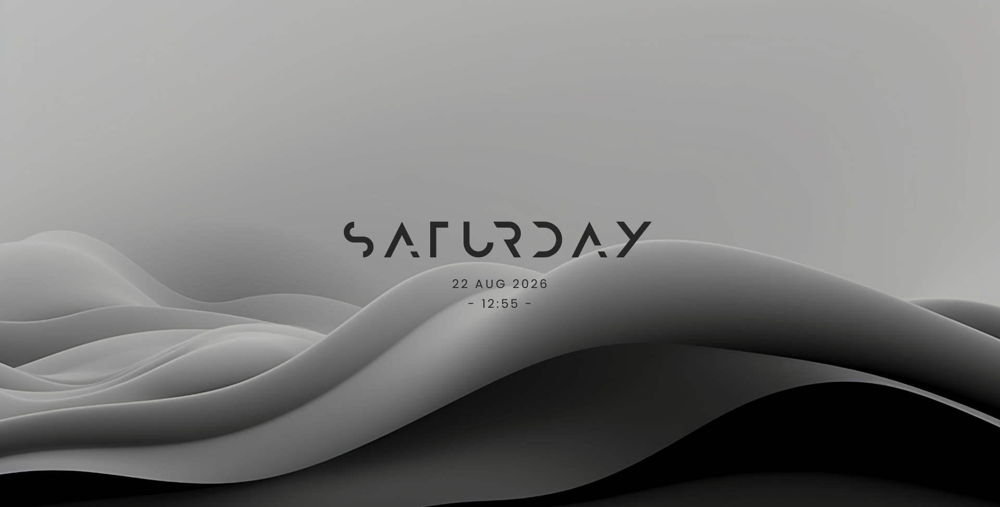
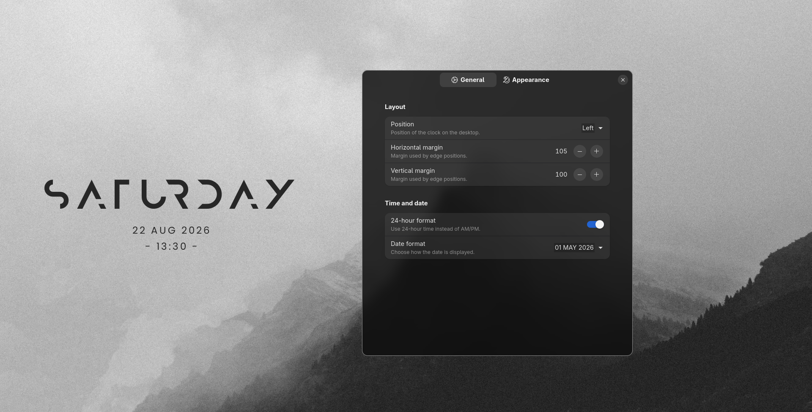
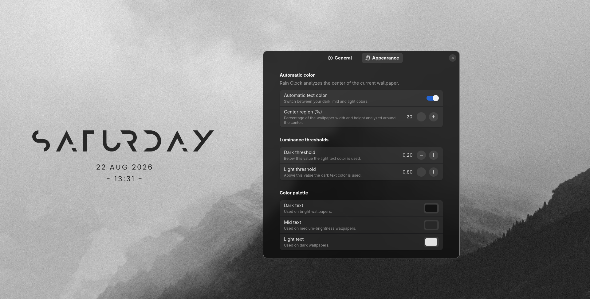

# Rain Clock GNOME

GNOME Shell extension providing a configurable desktop clock with flexible positioning, multi-monitor support, and wallpaper-aware text colors.




## Features


* 3×3 desktop positioning:

  * Top left
  * Top
  * Top right
  * Left
  * Center
  * Right
  * Bottom left
  * Bottom
  * Bottom right
* Configurable horizontal and vertical margins
* 12-hour and 24-hour time formats
* Text and numeric date formats
* Multi-monitor support

 

* Automatic text color based on wallpaper luminance
* Configurable center region used for wallpaper analysis
* Configurable luminance thresholds
* Resolution-based clock scaling



## Compatibility

Currently tested on:

* GNOME Shell 49
* Wayland

GNOME Shell versions are listed in `metadata.json` only after being tested.

## Installation

### From source

Clone the repository:

```bash
git clone https://github.com/hugo-sants/rain-clock-gnome.git
cd rain-clock-gnome
```

Install the extension and its bundled fonts:

```bash
make install
```

Install or update the fonts separately with:

```bash
make fonts-install
```

Enable it:

```bash
gnome-extensions enable rainclock@hugo-sants.github.com
```

Open the preferences:

```bash
gnome-extensions prefs rainclock@hugo-sants.github.com
```

## Configuration

Open the preferences through the Extensions application or:

```bash
gnome-extensions prefs rainclock@hugo-sants.github.com
```

### Layout

The clock can be positioned using a 3×3 layout:

```text
Top left       Top       Top right
Left           Center    Right
Bottom left    Bottom    Bottom right
```

Horizontal and vertical margins control the distance from the corresponding monitor edges.

### Time and date

Available options:

* 12-hour format with AM/PM
* 24-hour format
* Text date format
* Numeric date format

### Automatic color

Rain Clock can analyze the center region of the current wallpaper and select the clock color according to its luminance.

The resulting color is selected from three configurable values:

* Dark text for bright wallpapers
* Mid text for medium-brightness wallpapers
* Light text for dark wallpapers

The analyzed region and luminance thresholds can be configured from the preferences.

## Uninstallation

Disable the extension:

```bash
gnome-extensions disable rainclock@hugo-sants.github.com
```

Remove the installed extension:

```bash
make uninstall
```

Remove the installed fonts with:

```bash
make fonts-uninstall
```

## Credits

* Inspiration: [KDE Modern Clock](https://github.com/Prayag2/kde_modernclock) by Prayag2
* Design: Rainmeter skin "Mond"
* Fonts: Anurati by Emmeran Richard; Poppins by Indian Type Foundry

## License

Rain Clock is licensed under the GNU General Public License, version 3 or later.

See [LICENSE](LICENSE).
