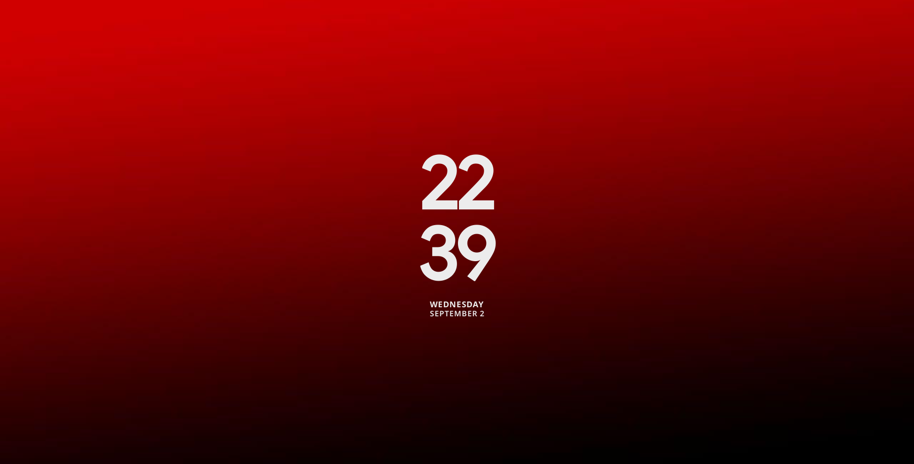

# Rain Clock GNOME

Configurable GNOME Shell clock focused on desktop-oriented layouts, multiple visual styles, multi-monitor support, and wallpaper-aware text colors.

## Styles




## Features

- 3×3 grid positioning on the desktop
- Visual style selection
- Configurable horizontal and vertical margins
- Multi-monitor support
- 12-hour and 24-hour time formats
- Text and numeric date formats
- Text color automatically adjusted to the wallpaper
- Custom text colors

## Installation

### From source

```bash
git clone https://github.com/hugo-sants/rain-clock-gnome.git
cd rain-clock-gnome
```

Install the extension and its bundled fonts:

```bash
make install
```

Install or update the fonts separately with:

```bash
make fonts-install
```

Enable it:

```bash
gnome-extensions enable rainclock@hugo-sants.github.com
```

Open the preferences:

```bash
gnome-extensions prefs rainclock@hugo-sants.github.com
```

## Configuration

Open the preferences through the Extensions application or:

```bash
gnome-extensions prefs rainclock@hugo-sants.github.com
```

## Credits

- Visual references: Mond and Summit Rainmeter skins
- Inspiration: [KDE Modern Clock](https://github.com/Prayag2/kde_modernclock) by Prayag2
- Fonts:
  - Anurati — Emmeran Richard
  - Poppins — Indian Type Foundry
  - Electroharmonix
  - Outfit
  - Google Sans
  - Gilroy Bold
  - Gilroy SemiBold

## License

Rain Clock is licensed under the GNU General Public License, version 3 or later.

See [LICENSE](LICENSE).